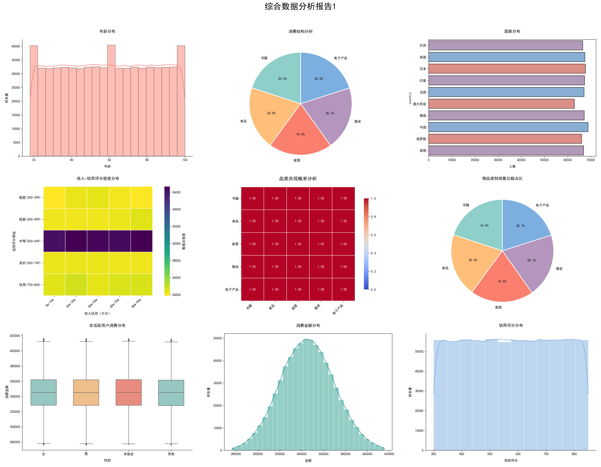
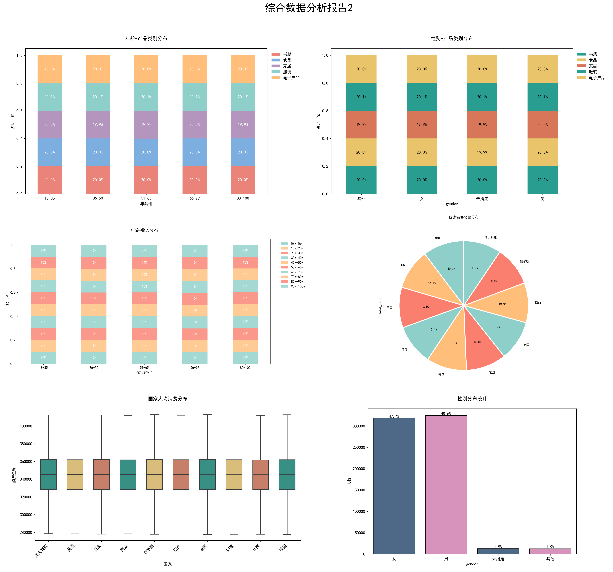

## 项目代码库介绍

### 1. 文件介绍

- `data_process_unify.py`：数据预处理程序（使用 cudf）
- `data_process_pandas.py`：数据预处理程序（完全使用 pandas）
- `duplicate_id_detect.py`：重复 id 检测程序
- `duplicate_user_id_detect.py`：use_id 重复率检测程序（详情介绍见实验报告）
- `post_visulize.py`：可视化及高价值用户识别程序
- `create_overview_analyse.py`：整体分析图绘制程序
- `sample_1000.csv`：采样数据，用于初步分析
- `processed_csv_10G/30G`：存储预处理结果
- `result_imgs/result_imgs_30G`：存储可视化结果
- `high_value_users/high_value_users_30G`：存储高价值目标用户信息
- `predict_model`：高价值用户识别模型相关（暂时不完善）

### 2. 代码使用说明

① **安装依赖**：

```bash
pip install requirements.txt
```

>这里 torch 和 cuml 的安装不是必须的，只是为了方便后面训练模型，可以选择不安装

② **数据预处理**

```bash
python data_process_unify.py --size [10G/30G]
```

该命令会对数据集进行分片处理，最终处理结果以 csv 格式保存在`processed_csv_10G/30G`文件夹中。

③ **数据可视化+高价值用户识别**

```bash
python post_visulize.py --size [10G/30G]
```

数据分析可视化处理结果会保存到`result_imgs/result_imgs_30G`文件夹内；高价值目标用户筛选结果会保存到 `high_value_users/high_value_users_30G`（内含两个文件，csv 文件存储高价值用户具体信息，png 图片展示高价值用户可视化分布结果）。

④ **可视化结果聚合（可选）**

```bash
python create_overview_analyse.py --size [10G/30G]
```

该命令用于聚合上一步生成的图片（共计15+2张，前15张会被聚合，后2张分别存为 `income_credit_analysis.png` 和 `income_spending_analysis.png` ，用于分析用户收入与消费水平和信用评分之间的关系）

预览图如下（以10G数据集为例）：






⑤ **二分类模型训练**

`predict_model` 文件夹内存储了模型训练的相关代码（一个简单的神经网络+随机森林模型），执行③中的命令时程序会自动创建一个包含识别出的高价值用户和非高价值用户的数据集，两者比例为 1:1，用于训练神经网络和随机森林模型（文件存为 `predict_model/balanced_train_set.csv`，后缀 30G 的另一个文件代表 30G 数据集挖掘出的训练数据）。

- 神经网络模型训练：

```bash
python neural_network_train.py --size [10G/30G]
```

- 随机森林模型训练：

```bash
python random_forest_train.py --size [10G/30G]
```

- 指标聚合及可视化

```bash
python aggreate_result.py
```

> 最终可视化结果会存到 `predict_model/figures` 和 `predict_model/results` 中，其中`figures` 文件夹存储神经网络训练损失及验证精度可视化图+神经网络与随机森林性能对比图，`results` 文件夹则以 csv 表格形式存储两模型的性能和对比结果。

不过目前这部分代码还不成熟，训练出来的模型效果很差，感觉跟数据本身质量有关。

贴一张训练示例图：


