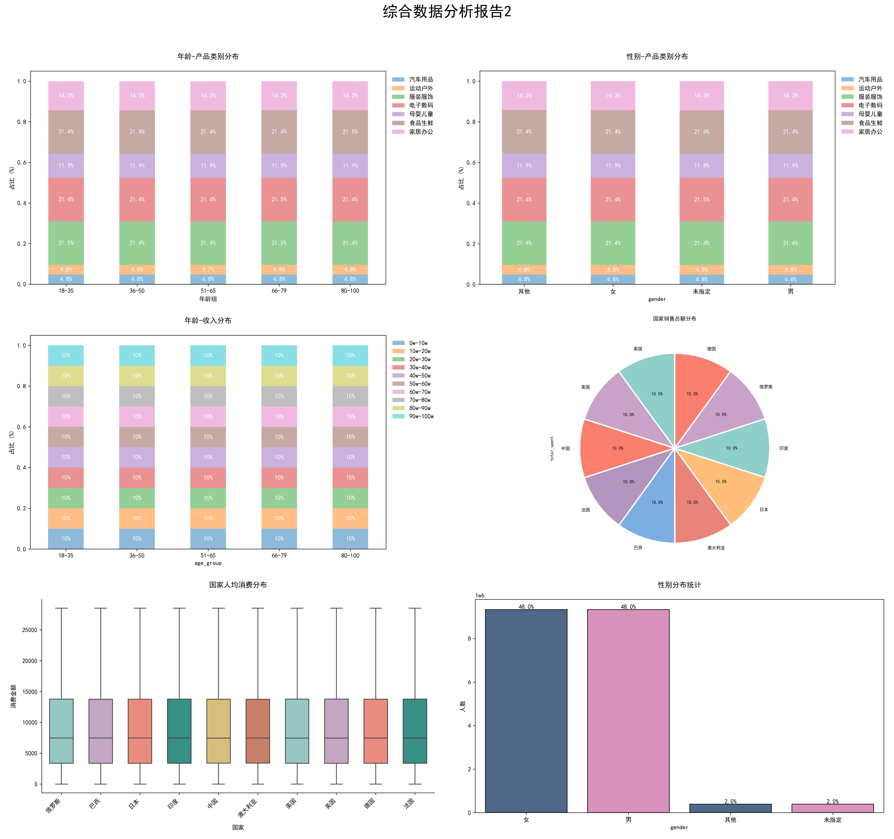

## 项目代码库介绍

### 1. 文件介绍

- `duplicate_data_detect.py`：重复数据检测程序
- `category_count.py`：购物类别统计程序
- `data_process_pandas.py`：数据预处理程序（完全使用 pandas）
- `data_process_cudf_partial.py`：数据预处理程序（使用 cudf 分片处理）
- `multi_run.py`：cudf 多 GPU 并行处理脚本
- `clear_sessions.sh`：用于清除 `multi_run.py` 运行后残余的会话窗口
- `post_visulize.py`：可视化及高价值用户识别程序
- `create_overview_analyse.py`：整体分析图绘制程序
- `[10G/30G]_data_new`：原始数据集存储文件夹
- `processed_csv_10G/30G`：存储预处理结果
- `result_imgs/result_imgs_30G`：存储可视化结果
- `high_value_users/high_value_users_30G`：存储高价值目标用户信息
- `predict_model`：高价值用户分类模型相关（暂时不完善）

> 该项目中所有原始数据文件以及代码运行过程中生成的数据文件均已删除，如需运行代码，请先自行填充原始数据到相关文件夹内。

### 2. 代码使用说明

① **安装依赖**

```bash
pip install requirements.txt
```

>这里 torch 和 cuml 的安装不是必须的，只是为了方便后面训练分类模型，可以选择不安装

② **数据探索与分析**

```bash
# 类别分析
python category_count.py --size [10G/30G]

# 重复数据分析
python duplicate_data_detect.py --size [10G/30G]
```

> 其余报告中提及的分析均融合到了数据预处理步骤，运行预处理代码即可看到相应结果

③ **数据预处理**

```bash
python multi_run.py --size [10G/30G] --gpus [并行处理GPU数]
```

该命令会自动对数据集进行并行分片处理，最终处理结果以 csv 格式保存在 `processed_csv_10G/30G` 文件夹中。

>  这里的多 GPU 并行使用 tmux 进行离线处理，因此多次运行前需要清除一下已存在的 tmux 会话，命令如下：
>
> ```bash
> sh clear_sessions.sh [10G/30G]
> ```

这里如果选择完全使用 pandas 进行计算，则需要执行：

```bash
python data_process_pandas.py --size [10G/30G]
```

> 关于使用 cudf 和纯 pandas 计算之间的区别，详情见实验报告

④ **数据可视化+高价值用户识别**

```bash
python post_visulize.py --size [10G/30G] --type [pandas/partial]
```
> type 参数用于处理③中不同预处理方式得到的数据文件。pandas 表示处理纯 pandas 方式得到的单个预处理数据文件，partial 表示处理多 GPU 并行方式得到的多个预处理数据文件。
数据分析可视化处理结果会保存到 `result_imgs/result_imgs_30G` 文件夹内；高价值目标用户筛选结果会保存到 `high_value_users[_30G]` 中（内含两个文件，csv 文件存储高价值用户具体信息，png 图片展示高价值用户可视化分布结果）

⑤ **可视化结果聚合（可选）**

```bash
python create_overview_analyse.py --size [10G/30G]
```

该命令用于聚合上一步生成的图片（共计 15+2 张，前 15 张会被聚合到 `composed_overview_imgs` 文件夹中，后 2 张分别存为 `payment_distribution.png` 和 `income_spending_analysis.png` ，前者用于分析用户支付方式和支付状态，后者用于分析用户收入水平和消费水平之间的关系）

聚合后的整体预览图如下（以10G数据集为例）：




⑥ **高价值用户二分类模型训练**

`predict_model` 文件夹内存储了模型训练的相关代码（一个简单的神经网络+随机森林模型），执行③中的命令时程序会自动创建一个包含识别出的潜在高价值用户和非高价值用户的数据集用于训练神经网络和随机森林模型，数据集中两种类别数据的比例为 1:1 (数据集名为  `predict_model/balanced_train_set.csv `，后缀 30G 的另一个文件代表 30G 数据集挖掘出的训练数据）

- 神经网络模型训练：

```bash
python neural_network_train.py --size [10G/30G]
```

- 随机森林模型训练：

```bash
python random_forest_train.py --size [10G/30G]
```

- 指标聚合及可视化

```bash
python aggreate_result.py
```

> 最终可视化结果会存到  `predict_model/figures`  和  `predict_model/results`  中，其中 `figures` 文件夹存储神经网络训练损失及验证精度可视化图+神经网络与随机森林性能对比图，`results` 文件夹则以 csv 表格形式存储两模型的性能数据与对比结果。

不过目前这部分代码还不完善，训练出来的模型效果很差，感觉跟模型结构、超参和数据质量都有点关系。
